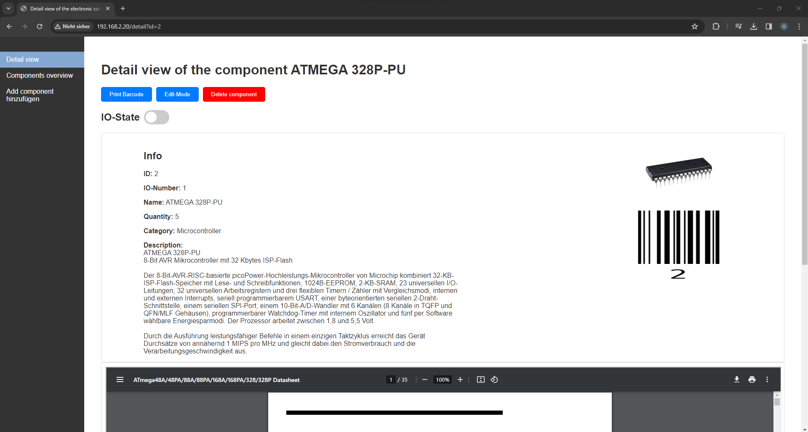

# Inventory Management System

## Overview
The Inventory Management System is a personal hobby project, currently in its early development stages. This system is a user-friendly web application built using Python Flask, specifically designed for efficient management of electrical components such as ICs. Its intuitive interface and robust features make it ideal for small hobby workshops.


## Key Features

### Data Management
- **Datasheet and Image Uploads:** Besides the name, quantity, and description, users can additionally upload a datasheet and image to each component, enriching the information available for every item in the inventory.

### Barcode Integration
- **Automated Barcode Assignment:** Every database entry is automatically assigned a unique barcode, the Barcode is saved in `code128` format.
- **Barcode Scanning:** Optional barcode scanner for quick component retrieval, enabling users to locate and track inventory items.

### Raspberry Pi Compatibility
- **Designed for Raspberry Pi:** Engineered to integrate with the Raspberry Pi, offering enhanced functionality.
- **WS2818 LED Strip Control:** Control a WS2812B LED strip via the Raspberry Pi, illuminating the location of components in the storage area.

### Docker Container
- **Configurable Docker Container:** The project includes a Dockerfile for easy setup and deployment. This containerized solution simplifies the process of starting the server.

## Application Modes and Functionalities

### Web Interface
- The web application provides a clear and accessible interface for managing the inventory, with modes including `Normal`, `Scan`, `IO`, and `Delete`.
- **Normal Mode:** Allows for standard browsing and searching of components within the inventory.
- **Scan Mode:** Facilitates scanning of barcodes to quickly find and display component details.
- **IO Mode:** Enables interaction with the IO functionality, particularly useful for handling LED indications for component locations.
- **Delete Mode:** Provides an easy way to delete components from the inventory, with confirmation prompts to prevent accidental deletions.

### Interactive Table
- The main interface includes an interactive table displaying component details such as ID, IO state, name, category, quantity, images, and barcodes.
- Components can be searched, highlighted, and selected for further actions based on the active mode.

### Web Interface Screenshots
<details open>
<summary><i>Images click to expand</i></summary>

#### Main Page


#### Detailed View


#### Edit Mode Detail View

</details>

## Configuration Settings
The system is configurable, with environment variables that can be set to tailor the application to specific needs. Key configuration parameters include database URI, image and PDF file types, barcode settings, and LED strip parameters. The detailed configuration can be found in the `config.py` file within the repository.

## Future Enhancements
As this is a hobby project in early development, future enhancements are planned.
- **User Accounts:** User accounts will be added to the system, allowing for more secure and personalized access.
- **UI Improvements:** The UI will be improved to be more user-friendly and intuitive.
- **Barcode Scanner:** The barcode scanner is currently only set up for 1D barcodes, but will be expanded to support 2D barcodes.
- **more...**

## Dockerfile Details
The Dockerfile is based on Ubuntu 22.04 and includes all necessary dependencies for the application. It's designed to be straightforward to use.

## Setup for Docker

1. **Prerequisites** 
    - Ensure Docker is installed on your system.
    - Make sure the .sh files are marked as executable:
        ```
        sudo chmod +x *.sh
        ```
2. **Build the Docker Image:**
   - In the root folder of the project, execute:
     ```
     sudo ./buildDocker.sh
     ```
   - *Wait for the Docker image to build. Duration depends on your system.*

3. **Create Docker Container:**
   - Execute:
     ```
     sudo ./createContainer.sh
     ```

4. **Run Docker Container:**
   - Start the container:
     ```
     sudo ./runImage.sh
     ```

5. **Access the System:**
   - Open a browser and navigate to the Inventory Management System using your system's IP address, e.g., `http://x.x.x.x/`.
